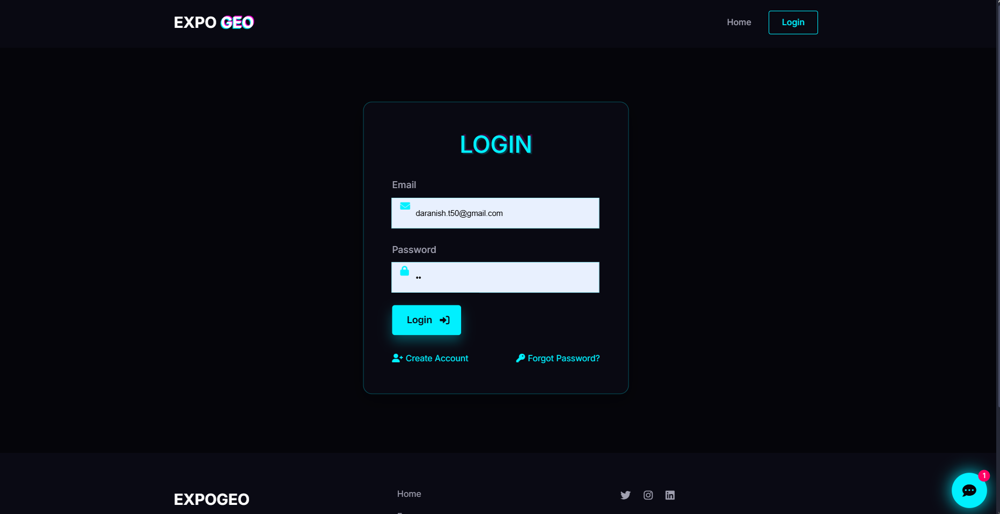
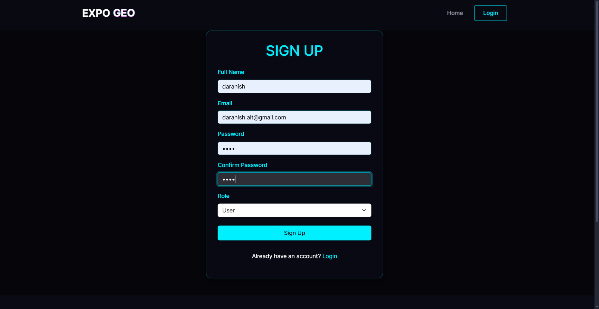
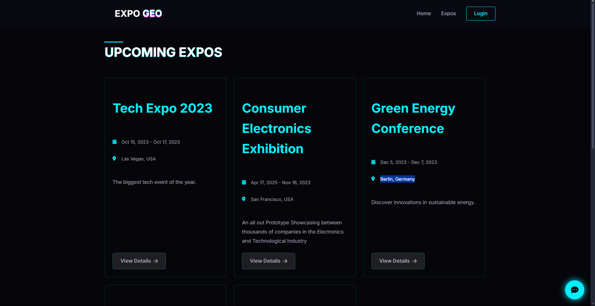
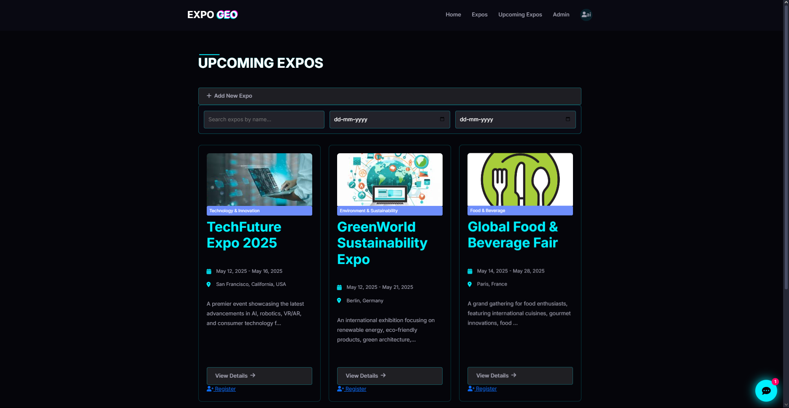
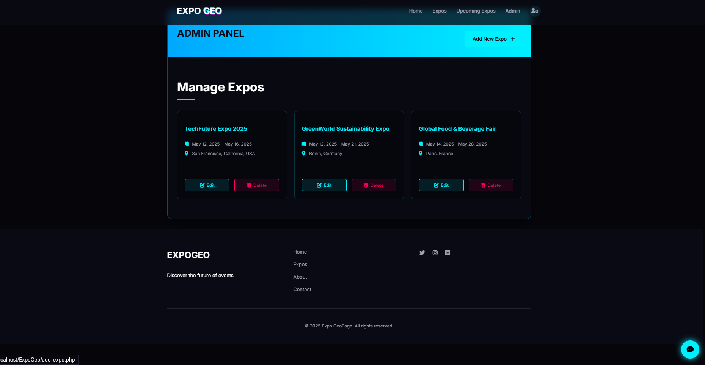
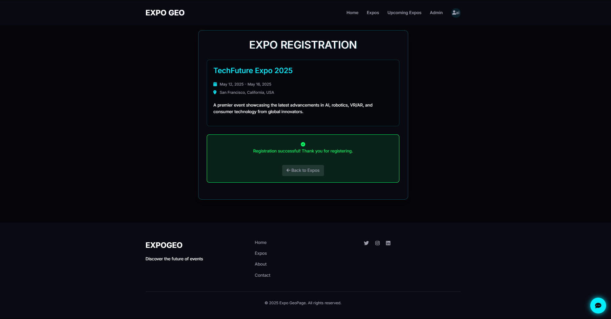

# EXPOGEO

[Brief description of what the project does. E.g., A simple inventory management system built with native PHP and MySQL.]


## Prerequisites

Before you begin, ensure you have the following installed on your local machine:

* **XAMPP** (or WAMP/MAMP) for the local web server and database.
    * [Download XAMPP here](https://www.apachefriends.org/download.html)
* **Git** (optional, if cloning via terminal).

## ⚙️ Installation & Setup

Follow these steps to get the project running on your local machine:

### 1. Clone or Download the Repository
1.  Navigate to your XAMPP installation folder (usually `C:\xampp\htdocs`).
2.  Open your terminal in this folder.
3.  Clone the repository:
    ```bash
    git clone [https://github.com/your-username/your-repo-name.git](https://github.com/your-username/your-repo-name.git)
    ```
    *(Or simply download the ZIP file and extract it into the `htdocs` folder. Rename the folder to something simple like `my-project`.)*

### 2. Set Up the Database
1.  Open the **XAMPP Control Panel** and start **Apache** and **MySQL**.
2.  Go to your browser and navigate to `http://localhost/phpmyadmin`.
3.  Click **New** on the sidebar to create a new database.
4.  Name the database `[insert_database_name]` (check your `config.php` or `db_connection.php` file to see what name the code expects).
5.  Click the **Import** tab at the top.
6.  Choose the `.sql` file provided in this repository (usually located in a `/database` or `/sql` folder).
7.  Click **Go** at the bottom to import the tables.

### 3. Configure the Project
1.  Open the project folder in your code editor.
2.  Locate the database configuration file (e.g., `config.php`, `db.php`, or `.env`).
3.  Ensure the credentials match your XAMPP settings (default is usually user: `root`, password: empty).

### 4. Run the Project
1.  Open your web browser.
2.  Go to:
    ```
    http://localhost/your-repo-name
    ```

## Screenshots

| Login Page | 

| |

| Sign In Page| 

||

| Dashboard |

|
|
|
|

##  Features

* [Feature 1: User Authentication]
* [Feature 2: Create/Read/Update/Delete (CRUD) functionality]
* [Feature 3: Responsive Design]

##  Contributing

1.  Fork the repository.
2.  Create a new branch (`git checkout -b feature-branch`).
3.  Commit your changes (`git commit -m 'Add new feature'`).
4.  Push to the branch (`git push origin feature-branch`).
5.  Open a Pull Request.

---
